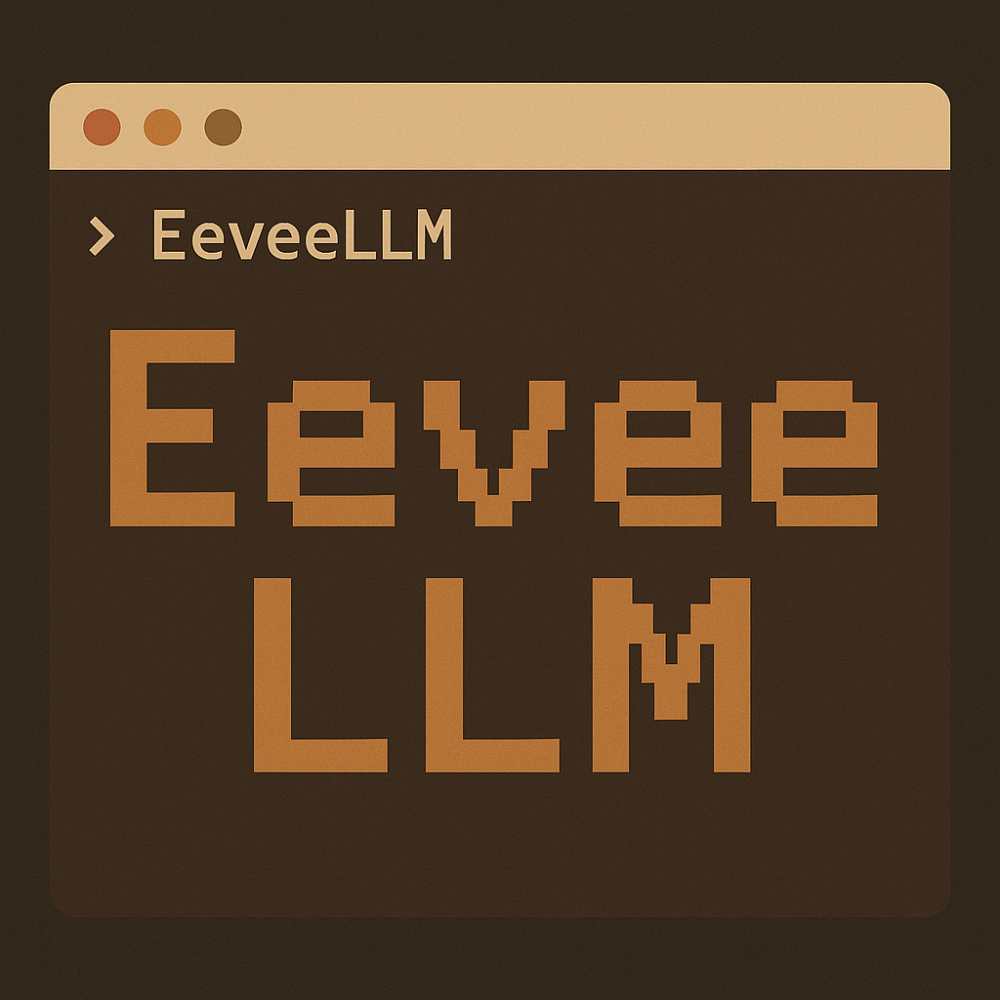

<div align="center">
  
</div>

# EeveeLLM - Your Living Pokemon Companion

An AI-powered Eevee companion with realistic brain processes, autonomous behavior, and genuine memory formation. Built with a unique "brain council" architecture where different brain regions debate and influence decisions.

## Features

### Currently Implemented (Phases 1-3)

**Phase 1: Foundation** ✅
- ✅ Interactive terminal interface with color support
- ✅ Eevee state management (hunger, energy, happiness, health)
- ✅ Personality system (curiosity, bravery, playfulness, loyalty, independence)
- ✅ Location-based world with 8 explorable areas
- ✅ NanoGPT API integration with intelligent fallback mode
- ✅ SQLite persistence for state and interactions
- ✅ Natural language responses
- ✅ Relationship tracking (trust and bond)
- ✅ Inventory system
- ✅ Time tracking between sessions

**Phase 2: Brain Council** ✅
- ✅ **5 Brain Regions**: Prefrontal Cortex (logic), Amygdala (emotion), Hippocampus (memory), Hypothalamus (needs), Cerebellum (instinct)
- ✅ **Weighted Voting System**: Each region votes with reasoning and confidence
- ✅ **Dynamic Weight Adjustments**: Weights change based on context (e.g., Amygdala dominates under threat)
- ✅ **Consensus Calculation**: Measures how unified or conflicted Eevee feels
- ✅ **Debug Visualization**: See internal deliberation with `debug brain` command
- ✅ **Context-Aware Decisions**: Responses reflect brain council's reasoning and emotional state

**Phase 3: Memory System** ✅ NEW!
- ✅ **Vector Memory Storage**: ChromaDB with semantic similarity search
- ✅ **4 Memory Types**: Episodic (events), Semantic (facts), Emotional (associations), Procedural (learned behaviors)
- ✅ **Significance-Based Formation**: Only meaningful interactions (>6.0/10) become long-term memories
- ✅ **Context-Aware Retrieval**: Hippocampus retrieves relevant memories during deliberation
- ✅ **Working Memory**: Short-term context (last 10 interactions)
- ✅ **Memory Browser**: Search and explore Eevee's memories with `remember` command
- ✅ **Automatic Strengthening**: Frequently accessed memories become stronger
- ✅ **Integrated with Brain Council**: Memories directly influence Hippocampus decisions

### Coming Soon (Phases 4-5)
- 🔜 Autonomous time passage simulation (Phase 4)
- 🔜 Activity generation during time gaps (Phase 4)
- 🔜 Random world events and surprises (Phase 5)
- 🔜 Evolution system (Phase 5)

## Installation

### Quick Install

1. **Clone the repository:**
   ```bash
   git clone https://github.com/YourBr0ther/EeveeLLM.git
   cd EeveeLLM
   ```

2. **Install dependencies:**
   ```bash
   pip install colorama pyyaml python-dateutil requests chromadb sentence-transformers
   ```

3. **Configure API key:**
   ```bash
   cp config.yaml.example config.yaml
   # Edit config.yaml and add your NanoGPT API key
   ```

4. **Run the application:**
   ```bash
   python main.py
   ```

### Configure NanoGPT API

The app works in **fallback mode** without an API key! But for full AI responses:

1. Get your API key from: https://nano-gpt.com/api
2. Copy the example config:
   ```bash
   cp config.yaml.example config.yaml
   ```
3. Edit `config.yaml` and replace `YOUR_API_KEY_HERE` with your actual key
4. Run the app!

**Note:** `config.yaml` is in `.gitignore` to protect your API key.

## Usage

### Basic Commands

- `talk [message]` - Speak to Eevee
- `pet` - Pet Eevee (increases happiness and trust)
- `play` - Play with Eevee (increases bond, costs energy)
- `give [item]` - Give Eevee an item (e.g., "give Oran Berry")
- `observe` - See what Eevee is currently doing
- `stats` - View detailed stats
- `world` - See current location and surroundings
- `go [location]` - Travel to a connected location
- `remember [query]` - Browse Eevee's memories (NEW in Phase 3!)
- `help` - Show all commands
- `debug brain` - Toggle brain council visualization
- `debug memory` - Toggle memory formation visualization (NEW!)
- `debug on/off` - Toggle full debug mode
- `exit` - Save and quit

### Example Interaction

```
> talk Hey Eevee!
You: Hey Eevee!

Eevee: *Eevee perks up excitedly* Vee! Veevee! *bounces on paws happily*

> play
You: *initiates playtime*

Eevee: *Eevee runs in excited circles, pouncing on their own tail* Vee vee!

> go meadow
Traveling to Wide Meadow...

> observe
Eevee seems cheerful and full of energy.

Eevee: *Eevee sniffs around excitedly* Vee! *discovering new scents*
```

## World Locations

- **Trainer's Home** - Safe starting point with food and shelter
- **Sunny Garden** - Pleasant garden perfect for playing
- **Wide Meadow** - Open area great for running and exploration
- **Clear Stream** - Fresh water and berry bushes
- **Forest Edge** - Mysterious border of the forest
- **Hidden Den** - Eevee's secret safe space
- **Sunny Hill** - Favorite napping spot with sunset views
- **Deep Forest** - Dangerous but exciting deep woods

## Configuration

Edit `config.yaml` to customize:
- NanoGPT API settings
- Time acceleration
- Initial personality traits
- Debug options
- UI preferences

## Architecture

```
eevee-project/
├── main.py                 # Entry point
├── config.py               # Configuration system
├── ui.py                   # Terminal UI
├── brain_council/          # Brain decision system (Phase 2)
├── memory/                 # Vector memory storage (Phase 3)
├── world/                  # Location and world system
│   └── locations.py
├── eevee/                  # Core Eevee logic
│   ├── state.py           # State management
│   ├── personality.py      # Personality traits
│   └── responses.py        # Response generation
├── llm/                    # LLM integration
│   ├── nanogpt_client.py  # API client
│   └── prompts.py          # Prompt templates
└── data/                   # Persistent data
    ├── eevee_save.db       # SQLite database
    └── memories/           # ChromaDB storage (Phase 3)
```

## Development Roadmap

### Phase 1: Foundation ✅
- Basic terminal UI
- State management
- Simple location system
- NanoGPT integration
- Basic responses

### Phase 2: Brain Council ✅
- 5 brain region classes
- Voting system
- Internal deliberation
- Context-aware modulation
- Debug visualization

### Phase 3: Memory System ✅
- ChromaDB vector storage
- 4 memory types (episodic, semantic, emotional, procedural)
- Significance-based consolidation
- Semantic similarity retrieval
- Hippocampus integration
- Memory browser command

### Phase 4: Time Passage 🔜
- Time tracking
- Activity generation
- Autonomous behavior
- Memory formation during gaps
- Timeline summaries

### Phase 5: Polish & Expansion 🔜
- Personality influence
- Complex emotions
- Rich world interactions
- Special events
- Evolution considerations

## Design Philosophy

**Authenticity Over Complexity** - Eevee should feel *real*, not robotic. Imperfect responses are more believable.

**Memory Makes Meaning** - Every significant interaction matters. Patterns emerge from repeated experiences.

**Time Creates Life** - Autonomous behavior makes Eevee feel alive. Things happen when you're away.

## Credits

Inspired by the Pokemon universe and designed to create the most realistic virtual companion experience possible.

Built with love for Pokemon and AI.

## License

This project is for educational and personal use.

---

*"Vee!"* - Eevee
